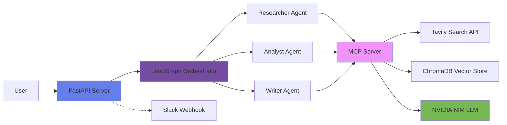

# Competitive Intelligence Pipeline
<!-- updated -->
<!-- pass 2 -->
<!-- pr-1 -->

Gathering competitive intelligence manually is time-consuming and inconsistent — analysts typically spend 4-6 hours per company pulling data from disparate sources, synthesizing it, and producing a structured report. This pipeline automates that process end-to-end: submit a company name, get a structured competitive analysis report in 60-90 seconds.

The system uses LangGraph to orchestrate three agents in sequence. The Researcher agent queries Tavily for real-time web data and stores results in ChromaDB for vector memory. The Analyst agent scores competitors across pricing, features, and market position using NVIDIA NIM (Llama 3.1 70B). The Writer agent produces a structured executive brief with a competitor matrix and 30-day recommendations. All agents communicate through a shared MCP Server that exposes tools for search, memory reads/writes, and LLM calls.

All LLM outputs are validated with Pydantic before being written to state. Input validation rejects generic or invalid company names before the pipeline runs. The API exposes two endpoints: `/analyze` for single-company analysis and `/compare` for head-to-head comparison. Structured JSON logs with request tracing are written throughout. Deploys with Docker + docker-compose; pytest test suite included.

## Architecture



**Flow**: User submits company name → FastAPI validates input → LangGraph orchestrates 3 agents (Researcher finds competitors, Analyst scores them, Writer generates executive brief) → Each agent uses MCP Server tools for search, memory, and LLM calls → Returns structured competitive intelligence report.

## Prerequisites

- Docker & Docker Compose
- NVIDIA NIM API key (free tier: https://build.nvidia.com/)
- Tavily Search API key (free tier: https://tavily.com/)
- Optional: Slack webhook for notifications

## Setup

```bash
# 1. Clone the repository
git clone https://github.com/yourusername/mcp-copilot-a2a.git
cd mcp-copilot-a2a

# 2. Configure environment
cp .env.example .env
# Edit .env and add your API keys:
# NVIDIA_API_KEY=nvapi-your-key-here
# TAVILY_API_KEY=tvly-your-key-here

# 3. Start services
docker-compose up --build

# 4. Wait for services to be ready (~30 seconds)
# Look for log message: "Application startup complete"

# 5. Test the API
curl http://localhost:8000/health
```

## Usage

### Web Interface

Open http://localhost:8000 in your browser for an interactive HTML interface.

### API - Single Company Analysis

```bash
curl -X POST http://localhost:8000/analyze \
  -H "Content-Type: application/json" \
  -d '{"company": "Notion"}'
```

**Expected Response** (60-90 seconds):
```json
{
  "executive_summary": "Notion faces intense competition in the productivity and project management space. Airtable is the top threat, with robust database and project management capabilities. Other significant competitors include Asana, Confluence, and Monday.com. Notion's pricing competitiveness, market presence in the project management space, and integration with other productivity tools are strategic gaps that need to be addressed. To stay competitive, Notion must focus on enhancing its features, improving its market presence, and offering more competitive pricing.",
  "competitor_matrix": "| Competitor | Pricing | Features | Market Position | Threat Level | Summary |\n| --- | --- | --- | --- | --- | --- |\n| Airtable | 8/10 | 9/10 | 8/10 | 8/10 | Robust database and project management capabilities |\n| Coda | 7/10 | 8/10 | 6/10 | 6/10 | All-in-one workspace and collaboration features |\n| ClickUp | 9/10 | 9/10 | 7/10 | 7/10 | Affordable pricing and extensive feature set |\n| Asana | 6/10 | 8/10 | 9/10 | 8/10 | Strong market position and robust project management features |\n| Confluence | 5/10 | 8/10 | 8/10 | 7/10 | Strong market presence and feature set, but less competitive pricing |\n| Slite | 8/10 | 7/10 | 5/10 | 5/10 | Affordable pricing and simple note-taking features, but limited market presence |\n| Basecamp | 4/10 | 7/10 | 6/10 | 5/10 | Higher pricing and limited feature set |\n| Monday.com | 6/10 | 8/10 | 7/10 | 7/10 | Robust feature set and growing market presence, but higher pricing |",
  "recommendations": [
    "Within the next 30 days, conduct a pricing review to ensure competitiveness in the market. Consider offering tiered pricing plans or discounts for long-term commitments.",
    "Develop a strategic partnership with a leading project management tool to enhance Notion's market presence in the project management space. This partnership should be announced within the next 30 days.",
    "Within the next 30 days, launch a targeted marketing campaign to promote Notion's integration with other productivity tools. This campaign should highlight the benefits of using Notion as a central hub for productivity and project management."
  ],
  "brief_markdown": "# Competitive Intelligence Brief\n\n## Executive Summary\nNotion faces intense competition in the productivity and project management space. Airtable is the top threat, with robust database and project management capabilities. Other significant competitors include Asana, Confluence, and Monday.com. Notion's pricing competitiveness, market presence in the project management space, and integration with other productivity tools are strategic gaps that need to be addressed.\n\n## Competitor Matrix\n| Competitor | Pricing | Features | Market Position | Threat Level | Summary |\n| --- | --- | --- | --- | --- | --- |\n| Airtable | 8/10 | 9/10 | 8/10 | 8/10 | Robust database and project management capabilities |\n| Coda | 7/10 | 8/10 | 6/10 | 6/10 | All-in-one workspace and collaboration features |\n| ClickUp | 9/10 | 9/10 | 7/10 | 7/10 | Affordable pricing and extensive feature set |\n| Asana | 6/10 | 8/10 | 9/10 | 8/10 | Strong market position and robust project management features |\n| Confluence | 5/10 | 8/10 | 8/10 | 7/10 | Strong market presence and feature set, but less competitive pricing |\n| Slite | 8/10 | 7/10 | 5/10 | 5/10 | Affordable pricing and simple note-taking features, but limited market presence |\n| Basecamp | 4/10 | 7/10 | 6/10 | 5/10 | Higher pricing and limited feature set |\n| Monday.com | 6/10 | 8/10 | 7/10 | 7/10 | Robust feature set and growing market presence, but higher pricing |\n\n## Analysis\nNotion's competitors offer a range of features and pricing plans, making it essential for Notion to differentiate itself in the market. The strategic gaps identified in this brief must be addressed to ensure Notion remains competitive.\n\n## Recommendations\n* Within the next 30 days, conduct a pricing review to ensure competitiveness in the market. Consider offering tiered pricing plans or discounts for long-term commitments.\n* Develop a strategic partnership with a leading project management tool to enhance Notion's market presence in the project management space. This partnership should be announced within the next 30 days.\n* Within the next 30 days, launch a targeted marketing campaign to promote Notion's integration with other productivity tools. This campaign should highlight the benefits of using Notion as a central hub for productivity and project management.",
  "generated_at": "2026-06-14T17:35:45.846570Z"
}
```

### API - Head-to-Head Comparison

```bash
curl -X POST http://localhost:8000/compare \
  -H "Content-Type: application/json" \
  -d '{"company_a": "Notion", "company_b": "Obsidian"}'
```

**Expected Response** (180-240 seconds):
```json
{
  "company_a": "Notion",
  "company_b": "Obsidian",
  "executive_summary": "Notion and Obsidian represent two fundamentally different approaches...",
  "comparison_matrix": "| Dimension | Notion | Obsidian |\n|-----------|--------|----------|\n...",
  "competitive_advantages": {
    "Notion": ["Collaboration features", "Cloud-native", "Database views"],
    "Obsidian": ["Local-first", "Plugin ecosystem", "Markdown-native"]
  },
  "market_positioning": "Notion targets teams and organizations...",
  "winner_analysis": "Notion has stronger market position for enterprise...",
  "recommendations": {
    "Notion": ["Add offline mode", "Improve markdown", "Plugin ecosystem"],
    "Obsidian": ["Team features", "Cloud sync UX", "Enterprise security"]
  },
  "generated_at": "2024-01-15T10:35:00Z"
}
```

### Health Check

```bash
curl http://localhost:8000/health
```

**Response**:
```json
{
  "status": "ok",
  "chroma": true,
  "llm": true
}
```

## Features

### Core Capabilities
- **Single Company Analysis**: `/analyze` - Comprehensive competitive landscape report
- **Head-to-Head Comparison**: `/compare` - Side-by-side analysis of two companies
- **Web Interface**: HTML frontend with markdown rendering
- **Slack Notifications**: Optional webhook integration for analysis completion alerts

### Intelligence Gathering
- **Tavily Search**: Real-time web search with fallback queries
- **Vector Memory**: ChromaDB stores past research for context
- **LLM Analysis**: NVIDIA NIM (Llama 3.1 70B) for structured reasoning

### Quality Assurance
- **Input Validation**: Rejects generic/invalid company names
- **Structured Output**: Pydantic schema validation with automatic retry
- **Error Handling**: Graceful degradation, never crashes on expected errors
- **Logging**: Structured JSON logs with request tracing

## Extending the Project

### How to Add a 4th Agent

The pipeline uses LangGraph to orchestrate agents. Here's how to add a new agent (e.g., a "Strategist" that generates action plans):

**Step 1**: Create the agent file `agents/strategist.py`

```python
from agents.base import BaseAgent
from schemas.messages import PipelineState, StrategistOutput, schema_json

SYSTEM_PROMPT = (
    "You are a strategic business advisor. Given competitive analysis, "
    "generate a 6-month action plan. Return ONLY valid JSON:\n{schema}"
)

class StrategistAgent(BaseAgent):
    """Generates strategic action plans based on competitive analysis."""

    def run(self, state: PipelineState) -> PipelineState:
        company = state["company"]
        analysis = state.get("analysis")
        
        if not analysis:
            return self._handle_error(
                ValueError("Analysis required for strategist"),
                state
            )
        
        try:
            prompt = f"Create a 6-month action plan for {company} based on: {analysis}"
            system = SYSTEM_PROMPT.format(schema=schema_json(StrategistOutput))
            
            strategy: StrategistOutput = self._call_llm(prompt, system, StrategistOutput)
            state["strategy"] = strategy.model_dump(mode="json")
            
        except Exception as e:
            return self._handle_error(e, state)
            
        return state
```

**Step 2**: Define the output schema in `schemas/messages.py`

```python
class StrategistOutput(BaseModel):
    """Strategic action plan output."""
    
    priorities: list[str] = Field(..., min_length=3, max_length=5)
    timeline: dict[str, list[str]] = Field(..., description="Month → actions")
    resources_needed: list[str] = Field(...)
    success_metrics: list[str] = Field(...)
```

**Step 3**: Register the agent in `orchestrator.py`

```python
from agents.strategist import StrategistAgent

_strategist: StrategistAgent | None = None

def _get_strategist() -> StrategistAgent:
    global _strategist
    if _strategist is None:
        _strategist = StrategistAgent()
    return _strategist

def run_strategist(state: PipelineState) -> PipelineState:
    """Execute the strategist agent."""
    return _get_strategist().run(state)
```

**Step 4**: Add to the graph in `orchestrator.py` → `build_graph()`

```python
def build_graph() -> StateGraph:
    graph = StateGraph(PipelineState)
    
    # Existing nodes
    graph.add_node("validate_input", validate_input)
    graph.add_node("researcher", run_researcher)
    graph.add_node("analyst", run_analyst)
    graph.add_node("writer", run_writer)
    
    # New node
    graph.add_node("strategist", run_strategist)
    
    # ... existing edges ...
    
    # Insert strategist between analyst and writer
    graph.add_conditional_edges(
        "analyst",
        should_continue,
        {"continue": "strategist", "end": END},
    )
    graph.add_conditional_edges(
        "strategist",
        should_continue,
        {"continue": "writer", "end": END},
    )
    
    return graph
```

**Step 5**: Update `PipelineState` TypedDict in `schemas/messages.py`

```python
class PipelineState(TypedDict, total=False):
    company: str
    research: Optional[dict]
    analysis: Optional[dict]
    strategy: Optional[dict]  # Add this line
    output: Optional[dict]
    error: Optional[str]
    failed_at: Optional[str]
```

**Step 6**: Add tests in `tests/test_pipeline.py`

```python
def test_strategist_agent():
    with patch("agents.base.BaseAgent._invoke_llm") as mock_llm:
        mock_llm.return_value = json.dumps({
            "priorities": ["P1", "P2", "P3"],
            "timeline": {"Month 1": ["Action 1"]},
            "resources_needed": ["Resource 1"],
            "success_metrics": ["Metric 1"]
        })
        
        state = {"company": "Test", "analysis": {"scores": []}}
        result = run_strategist(state)
        
        assert result.get("strategy") is not None
        assert "priorities" in result["strategy"]
```

The pipeline will automatically:
- ✅ Execute the strategist after the analyst
- ✅ Handle errors and route to END if needed
- ✅ Include strategy output in the final state
- ✅ Log execution with structlog

## Configuration

All configuration is via environment variables in `.env`:

| Variable | Description | Required | Default |
|----------|-------------|----------|---------|
| `NVIDIA_API_KEY` | NVIDIA NIM API key | Yes | - |
| `NVIDIA_BASE_URL` | NIM endpoint URL | No | https://integrate.api.nvidia.com/v1 |
| `NVIDIA_MODEL` | Model name | No | meta/llama-3.1-70b-instruct |
| `TAVILY_API_KEY` | Tavily search API key | Yes | - |
| `SLACK_WEBHOOK_URL` | Slack webhook for notifications | No | - |
| `CHROMA_HOST` | ChromaDB hostname | No | chromadb |
| `CHROMA_PORT` | ChromaDB port | No | 8000 |
| `LOG_LEVEL` | Logging level | No | INFO |

## Development

### Running Tests

```bash
# All tests
pytest -v

# Specific test suite
pytest tests/test_schemas.py -v
pytest tests/test_pipeline.py -v

# With coverage
pytest --cov=. --cov-report=html
```

### Code Quality

```bash
# Type checking (install mypy first)
mypy . --ignore-missing-imports

# Linting
pylint agents/ mcp_server/ schemas/

# Format code
black .
```

## Troubleshooting

### "Connection refused" on port 8000
Wait for services to fully start (~30-60 seconds). Check logs: `docker-compose logs -f`

### "Invalid API key"
Verify your API keys in `.env` have no quotes or extra spaces.

### "ChromaDB not healthy"
ChromaDB initialization can take 30-60 seconds. Wait and retry.

### "No competitive data found"
Try a more well-known company name (e.g., "Notion", "Slack", "Figma").

### Analysis times out
- Increase Docker container memory (Settings → Resources)
- Check NVIDIA NIM API rate limits
- Verify network connectivity

## Performance

- **Health Check**: <1 second
- **Single Analysis**: 60-90 seconds (typical)
- **Comparison**: 180-240 seconds (runs two analyses)
- **Memory**: ~500MB per container
- **Disk**: ~2GB (Docker images + ChromaDB volume)

## Project Structure

```
mcp-copilot-a2a/
├── agents/              # AI agents (researcher, analyst, writer)
├── mcp_server/          # MCP server with tool implementations
│   └── tools/           # Search, memory, HTTP tools
├── schemas/             # Pydantic models and state definitions
├── tests/               # Comprehensive test suite
├── api.py               # FastAPI application
├── orchestrator.py      # LangGraph pipeline orchestration
├── constants.py         # Application constants
├── docker-compose.yml   # Service configuration
├── Dockerfile           # Container image
└── requirements.txt     # Python dependencies
```

## Contributing

See [CONTRIBUTING.md](CONTRIBUTING.md) for development guidelines.

## License

MIT License - see [LICENSE](LICENSE) file for details.

---

Built with [LangGraph](https://github.com/langchain-ai/langgraph), [FastAPI](https://fastapi.tiangolo.com/), [NVIDIA NIM](https://build.nvidia.com/), [Tavily](https://tavily.com/), and [ChromaDB](https://www.trychroma.com/).
